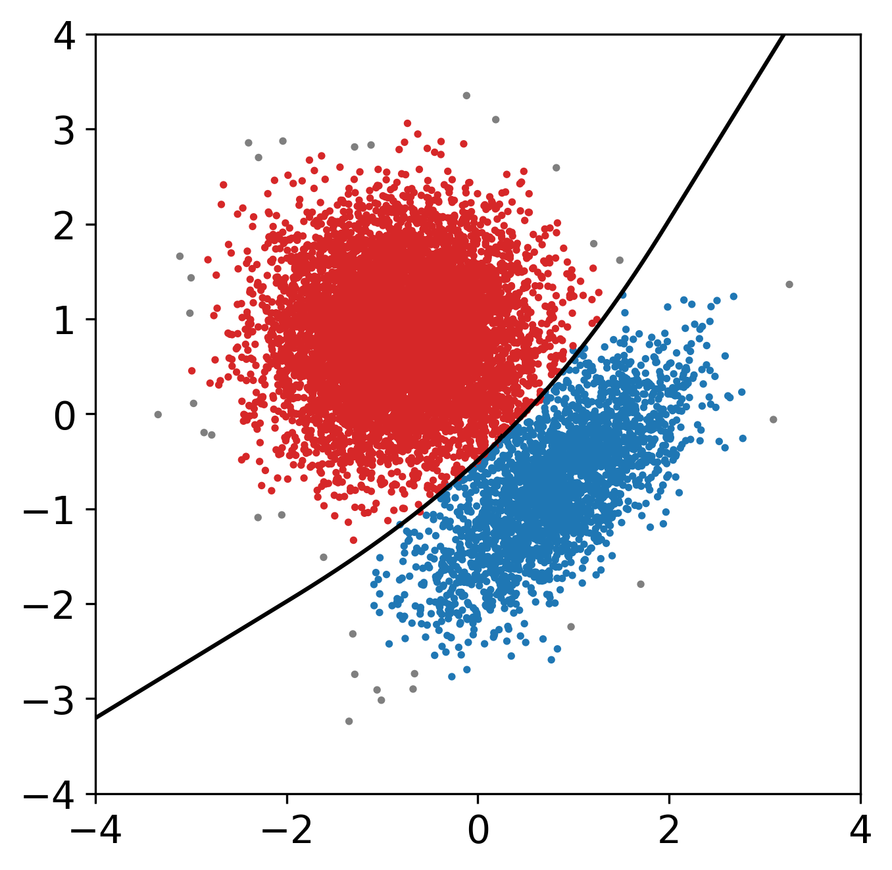
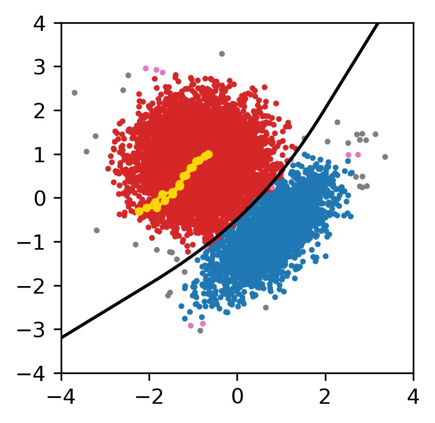

# Graph Max Shift
This repository is associated with the paper: Graph Max Shift: A Hill-Climbing Method for Graph Clustering (TO DO: ARXIV LINK) 

We present a method for the clustering of graph data (graph partitioning).
Our focus will be random geometric graphs with nodes corresponding to points that are generated iid from a density with sufficient regularity, and edges connecting all pairs $\{y_i, y_j\}$ with $||y_j - y_j|| \leq  r$. The basic question that motivates the present work is the following:
*Given a random geometric graph, is it possible to partition the graph in a way which is consistent with the clustering given by gradient ascent flow of the density?* For more information on the gradient flow approach to clustering, see, for example [Fukunaga and Hostetler (1975)](https://ieeexplore.ieee.org/document/1055330) and [Chac&oacute;n (2015)](https://projecteuclid.org/journals/statistical-science/volume-30/issue-4/A-Population-Background-for-Nonparametric-Density-Based-Clustering/10.1214/15-STS526.full).

We answer the question affirmatively and the method we propose is as follows. Consider a graph with $n$ nodes and adjacency matrix $A = (a_{ij})$ where, as usual, $a_{ij} = 1$ exactly when $i$ and $j$ are neighbors in the graph, and $=0$ otherwise. Let $q_i$ be the degree of node $i$. Starting from each node $i$, we construct a hill-climbing path by moving at iteration $t$ to node $i_t$ where $$i_t \in \text{argmax}$  $\{ q_j : a_{ij} = 1} $$

In plain words, Graph Max Shift iteratively moves to neighbor with highest the degree. We then cluster together nodes whose hill-climbing paths end at the same node. Finally, we merge together any two clusters whose associated nodes are within $m$ hops. 

In what follows, we provide the code for the Graph Max Shift algorithm, as well as the code to reproduce all figures in the paper. 

 
# Example Usage 

In this example, we will use the bimodal gaussian mixture, $f = \frac{1}{4}N(\mu_1 = .8,\mu_2 = -.8, \sigma_1 = \frac{2}{3}, \sigma_2 = \frac{2}{3}, \rho_{12} =  \frac{7}{10}  ) + \frac{3}{4}N(\mu_1 = -.8,\mu_2 = .8, \sigma_1 = \frac{2}{3}, \sigma_2 = \frac{2}{3}, \rho_{12} =  0  )$

We first construct a GaussianMixture object

``` from graph_max_shift import *
weights = [1/4, 3/4]
means = [np.array([.8,-.8]), np.array([-.8,.8])]
covs = [np.array([[(2/3)**2,(7/10)*(2/3)**2], [(7/10)*(2/3)**2, (2/3)**2]]), np.array([[(2/3)**2,0], [0, (2/3)**2]])]
bimodal = GaussianMixture(weights, means, covs)
```

We can obtain the boundaries of the ground truth clusters as defined by the basins of attractions. This will be useful for evaluating our clustering. 
```
modes, saddle, boundaries = ground_truth_clustering(bimodal)
```

Next, we sample data, construct a graph, and apply Graph Max Shift to the graph with edges connecting pairs within distance $.25$. 

```
n = 10000
data = bimodal.sample(n)
graph = GeometricGraph(data, max_dist = .5, batch_size=5000) 

maxshift = GraphMaxShift(graph)
maxshift.cluster(r = .25, m = 1) 

# visualize the results
clusters = maxshift.reindex_clusters(min_count = 25)
plt.figure(figsize = [5,5])
plt.scatter(data[:,0], data[:,1], c = clusters, cmap = ListedColormap(['tab:grey', 'tab:red', 'tab:blue' ]), s = 3)
for path in boundaries :
    plt.plot(path[:,0], path[:,1], color = 'black')
plt.xlim(-4,4)
plt.ylim(-4,4)
```



The code also supports a more complicated tie-breaking mechanism, in which all paths are followed. In this case, a point may belong to more than one cluster. 

```
maxshift = GraphMaxShift(graph, tie_method = 1 ) #change tie_method
maxshift.cluster(r = .25, m = 1)

clusters = maxshift.reindex_clusters(min_count = 25) # points that belong to multiple clusters are colored pink
paths = maxshift.get_path(7) #visualize paths starting from node 7
plt.figure(figsize = [5,5])
plt.scatter(data[:,0], data[:,1], c = clusters, cmap = ListedColormap(['tab:pink','tab:grey', 'tab:red', 'tab:blue' ]), s = 3)
for path in paths:
    plt.plot(data[path, 0], data[path,1],  marker = 'o', color = 'gold', markersize=3)
for path in boundaries :
    plt.plot(path[:,0], path[:,1], color = 'black')
    
plt.xlim(-4,4)
plt.ylim(-4,4)
```



# Files 

The repository contains the following files:

- `graph_max_shift/`

    - `main.py` contains the code of the main method for clustering a graph and the code to construct the graph from data points in space
    
    - `utils/`
         - `mixture_population_clustering.py` implements the numerical method described in Section 3.1 of [Chac&oacute;n (2015)](https://projecteuclid.org/journals/statistical-science/volume-30/issue-4/A-Population-Background-for-Nonparametric-Density-Based-Clustering/10.1214/15-STS526.full) to obtain the ground truth (gt) clustering for Gaussian mixtures. The method is based on Theorem 1 in [Ray & Lindsay (2005)](https://projecteuclid.org/journals/annals-of-statistics/volume-33/issue-5/The-topography-of-multivariate-normal-mixtures/10.1214/009053605000000417.full). In practice, the method works well for a bimodal mixture with minimal hyperparameter tuning but we find that some adjustments needed to be made for other mixtures, and these are documented in `figures/mixtures.ipynb`.
        - `mixture_model.py`is used to generate data from a Gaussian mixture and can be used to calcuate the density, gradient, and hessian of the mixture (which is useful in determining the population clustering)
        - `max_shift.py` implements the mediod Max Shift method as described in [Arias-Castro & Qiao (2022)](https://arxiv.org/abs/2202.09023). we use this in Figure 4
      
   

- `figures/` contains code to reproduce all figures in the paper 
    - `data/` contains the data samples used in our numerical experiments for reproducibility purposes
    - `plots/` contains the generated figures
   
    - `mixtures.ipynb` (Figure 1)
    - `parameter_tuning.ipynb` (Figures 2 and 3)
    - `visualize_paths.ipynb` (Figure 4)
    - `parameter_tuning_b.ipynb` (Additional example) 
    

# Requirements
The code is built in Python (3.11.5) and the following packages:
- NumPy (1.24.3)
- SciPy (1.11.1)
- Matplotlib (3.7.2)
- tqdm 
- igraph (0.11.6) 


# Citation 

`@article{graphmaxshift,
  title={Graph Max Shift: A Hill-Climbing Method for Graph Clustering},
  author={Ery Arias-Castro and Elizabeth Coda and Wanli Qiao},
  journal={arXiv preprint arXiv: TODO},
  year={2024}
}` 

